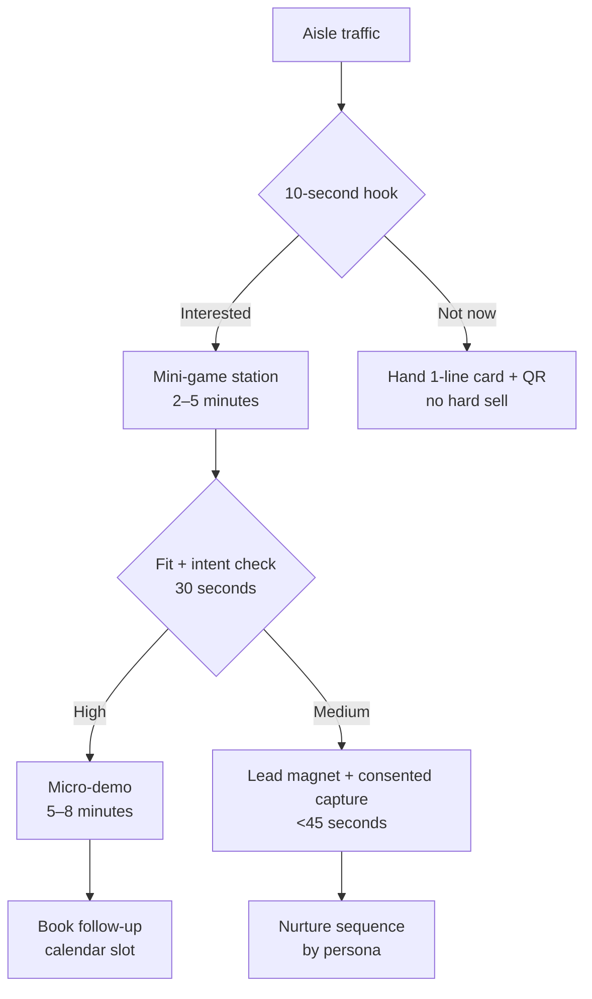

# Booth Engagement Mini-Games for SGFarmApp at World Aquaculture Singapore 2026

## Summary

World Aquaculture Singapore 2026 (a entity["organization","World Aquaculture Society","aquaculture society, usa"] meeting) runs 2–5 June 2026 in entity["city","Singapore","city-state, sg"], at entity["point_of_interest","Singapore EXPO Convention & Exhibition Centre","singapore, singapore, sg"], and explicitly positions itself as both a conference and “major international trade show” for aquaculture technologies, with producer-focused programming. citeturn1view0turn14search2

For a farmer-targeted booth, the event format creates predictable high-yield engagement windows: trade show hours (10:00–19:30 on 3 June; 10:00–19:00 on 4 June; 10:00–16:00 on 5 June) plus “refreshment breaks”, lunch blocks, and evening networking/social sessions that drive concentrated expo-floor movement. citeturn1view0turn14search2

The recommended booth strategy is to run **four short, repeatable mini-games (2–5 minutes each)** that (a) make SGFarmApp feel *trialable* and *easy* in the moment, (b) demonstrate concrete farm-operational workflows already present in the product (feeding logs, harvest logs, mortality/grading/sampling flows, offline-first sync), and (c) produce clean, consented lead capture tied to a follow-up nurture sequence. This aligns with adoption evidence that uptake improves when innovations show clear relative advantage, low complexity, and easy trialability/observability. citeturn12search4turn11search6turn11search16

## Assumptions

Booth and organiser-provided inclusions are assumed from the exhibitor invite: **standard booth 2×3m at USD 2,800** (corner 2×3m at USD 3,100), and booths include hard walls, electricity, carpet, two chairs, one table, spotlights, fascia identification sign, and two conference passes. citeturn7view0

The exhibitor invite states the trade show is in **Hall 2B** and indicates **“Total 213 Booths”**—i.e., high competitive noise and limited “idle attention”. citeturn7view0

Attendee numbers, booth location within the hall, WLAN reliability, permitted audio levels, and lead retrieval rules are not provided in accessible materials; the plan assumes:
- a **single 2×3m inline booth** (front-open),
- **no guaranteed high-bandwidth internet** on the show floor (design is offline-tolerant),
- a need to comply with local data protection expectations for consent-based lead capture (implemented operationally through explicit opt-in, minimal fields, and clear retention purpose).

Where quantitative ROI is shown, it is a **scenario model** (not a claim about this specific event) because organiser-published footfall and conversion benchmarks are not available in the retrieved WAS materials.

## Analysis

### WAS meeting audience, format, and booth engagement opportunities

The meeting positioning and copy indicate a mixed audience: practitioners/producers, academics, and commercial companies in the region and globally, supported by “special Producer Sessions” that explicitly target producer concerns. citeturn1view0turn14search2

The visible programme structure (plenaries/sessions alongside long trade-show opening hours, repeated refreshment breaks, and happy hour/poster sessions) is favourable for **booth micro-activations** because it naturally creates:
- **high-density corridors** after plenaries and during breaks,
- **drop-in behaviour** when attendees have 10–30 minutes between sessions,
- **repeat encounters** (multi-day passes) where visitors can return for a second game or deeper demo. citeturn1view0turn14search2

Industry research on B2B exhibitions supports designing for interaction: CEIR reports that attendees want immersive, hands-on experiences and expect to engage knowledgeable exhibitor staff. citeturn15search1 The same CEIR source base frequently used in the industry also cites high buying authority among attendees (commonly referenced as 81%); while not event-specific, it justifies prioritising **qualification + next-step scheduling** over pure swag distribution. citeturn10search12

### SGFarmApp feature surface that maps well to mini-games

The SGFarmApp repository describes a farm-operations app with **core operational logging workflows** that are naturally “gameable” as short scenario challenges:
- **Feed Fish** logging as a primary workflow, with operational flow and user steps documented. fileciteturn9file0L1-L1  
- **Harvest** logging designed as **weight-only input** with server-side proportional quantity calculation and conflict handling (e.g., weight exceeding biomass), plus offline-first behaviour. fileciteturn13file0L1-L1  
- Additional operational flows such as **mortality, grading, sampling**, and **multi-location selection** patterns. fileciteturn11file0L1-L1  
- A documented enhancement for **location grouping** (flat vs group-by-feedtype vs group-by-batch) across multiple logging flows—useful for a “find the right cage/batch fast” challenge. fileciteturn12file0L1-L1  
- Mobile characteristics including **authentication and offline-first patterns** (positioning-relevant for farms with variable connectivity). fileciteturn10file0L1-L1  

This is strategically aligned with how digital aquaculture is discussed in the literature: feeding, monitoring, and decision support are repeatedly identified as high-value domains for “precision aquaculture” and DSS maturity—yet real on-farm adoption often stalls without usability, deployment fit, and credible cost–benefit pathways. citeturn12search0turn12search1

### Engagement design principles used for the mini-games

The mini-games are designed to deliberately trigger adoption drivers from established acceptance/diffusion models:
- **Perceived usefulness + perceived ease of use** (TAM): show a workflow completed quickly and correctly, with a tangible “so what” for farmers. citeturn11search6  
- **Trialability + reduced complexity** (Diffusion of Innovations): let visitors “try” a realistic scenario without commitment, with immediate feedback and no embarrassment cost. citeturn12search4  
- **Facilitating conditions** (UTAUT/UTAUT2 extensions): demonstrate offline-first and operational continuity as enabling conditions. citeturn11search16  
- **Exhibition floor reality** (CEIR): hands-on engagement with staff coaching beats passive theatre-style delivery. citeturn15search1  

image_group{"layout":"carousel","aspect_ratio":"16:9","query":["interactive trade show booth quiz kiosk","small 3x2 meter exhibition booth layout","trade show gamification spin wheel booth","tablet kiosk stand exhibition"],"num_per_query":1}

### Mini-game concepts tied to SGFarmApp features

#### Game concept comparison matrix

| Mini-game | Primary objective | Typical duration | Throughput design | SGFarmApp features taught (explicit) | Lead capture moment |
|---|---:|---:|---:|---|---|
| Feed-Wise Sprint | Teach feeding log flow + location selection patterns | 2–3 min | 1–2 tablets, parallel play | Feed Fish workflow; optional grouping by feed type/batch; fast “select location → input → submit” mental model fileciteturn9file0L1-L1 fileciteturn12file0L1-L1 | After completion: QR “Get the feeding checklist + book a farm onboarding” |
| Harvest Maths Challenge | Teach harvest weight-only entry + server calculation logic | 3–4 min | tabletop micro-game | Harvest: weight input, proportional quantity calculation, conflict concepts (e.g., weight exceeds biomass) fileciteturn13file0L1-L1 | After score reveal: scan-to-email for the “Harvest worksheet” |
| Offline Ops Relay | Prove offline-first reliability + sync story | 4–5 min | “two-station” relay | Offline-first patterns + operational flows (mortality/grading/sampling) fileciteturn10file0L1-L1 fileciteturn11file0L1-L1 | At “sync dock”: scan badge/QR + select follow-up time |
| Batch Detective Board | Teach lifecycle thinking (batch → cage → ops) + location grouping | 3–5 min | magnet board + facilitator | Core features across feeding/mortality/grading/harvest; group-by-batch logic fileciteturn11file0L1-L1 fileciteturn12file0L1-L1 | At completion: pick persona track + consented contact capture |

#### Mini-game detail designs

##### Feed-Wise Sprint

**Name**: Feed-Wise Sprint: “3 cages, 1 minute”  
**Objective**: Help farmers experience that logging feeding can be structured, fast, and consistent—without needing perfect connectivity. (Perceived ease of use + usefulness.) citeturn11search6turn12search4  

**Rules and mechanics**  
Players are given a simple scenario card (species/batch, 3 cages, feeding target). They must:
1) select the correct farm/area,  
2) select cages using the location selection screen pattern,  
3) log feed actions for each cage (e.g., feed amount + simple inputs),  
4) complete and “submit”.  
A timer runs; score = (completion + accuracy + optional “bonus” for using the right grouping mode). The location grouping concept (flat vs grouped) is explicitly tied to the documented location-display settings. fileciteturn9file0L1-L1 fileciteturn12file0L1-L1  

**Duration**: 2–3 minutes (target: <180 seconds).  

**Required materials / tech**  
- 1–2 tablets (Android preferred if aligning with the mobile build) on lockable stands  
- A demo build or click-through prototype that mirrors the Feed Fish flow steps  
- Printed “scenario cards” for queue speed  
- Optional: small LED timer display  

**Staffing**  
- 1 “Game Coach” (explains in 10 seconds, observes, then transitions to next step)  
- 1 “Qualifier/Closer” during peak windows (captures lead + schedules next step)  

**Expected learning outcomes (tied to SGFarmApp)**  
- Players understand the practical sequence of Feed Fish logging and why it reduces variation in records. fileciteturn9file0L1-L1  
- Players see that location selection can be structured (including grouping modes) to reduce mis-selection errors in multi-location operations. fileciteturn12file0L1-L1  

**KPIs (engagement + lead capture)**  
- Participation rate (stops → plays)  
- Completion rate (<3 minutes)  
- “Assisted demo” rate (players who ask the coach a question)  
- Lead capture rate (completions → consented contacts)  
- Meeting set rate (leads → booked follow-up)

##### Harvest Maths Challenge

**Name**: Harvest Maths: “Weight in, quantity out”  
**Objective**: Teach a distinctive harvest concept in SGFarmApp: staff input harvest **weight only**, while the backend calculates fish quantity proportionally (and handles edge conflicts), minimising manual counting burden. fileciteturn13file0L1-L1  

**Rules and mechanics**  
Attendees get a “cage card” displaying:
- current biomass (kg)  
- current quantity (fish)  
- target harvest weight (kg)  
They must estimate calculated quantity using the proportional logic and then compare against the “SGFarmApp answer”. Include one “conflict card” where weight exceeds biomass: the facilitator explains the conflict handling concept and how partial acceptance could work conceptually (as documented). fileciteturn13file0L1-L1  

**Duration**: 3–4 minutes.  

**Required materials / tech**  
- Tabletop cards + tokens (fish icons)  
- A small laminated “formula strip” (kept plain-language)  
- Optional: tablet showing the harvest step flow/confirmation screens  

**Staffing**  
- 1 facilitator (this game is explanation-heavy, but fast)  

**Expected learning outcomes**  
- Visitors remember a *specific operational differentiator* (weight-only entry + automated quantity calculation), which supports perceived usefulness (less manual work, more standardisation). fileciteturn13file0L1-L1 citeturn11search6  

**KPIs**  
- % players who can restate the logic (“weight in, system calculates quantity”)  
- Follow-up intent tags: “Harvest module interest”  
- Conversion to “request a pilot/onboarding session” for farms actively harvesting

##### Offline Ops Relay

**Name**: Offline Ops Relay: “Log now, sync later”  
**Objective**: Make offline-first real and believable on a noisy expo floor: show that core farm actions can be recorded even with unstable connectivity and synchronised later. This addresses a frequent real-world “facilitating conditions” barrier in technology adoption. fileciteturn10file0L1-L1 citeturn11search16  

**Rules and mechanics**  
Two stations inside the booth:
- **Station A (Offline)**: attendee uses a demo phone in airplane mode to complete *one* mini-log (choose one: mortality, grading, sampling) using a simplified flow.  
- **Station B (Sync Dock)**: attendee “syncs” (turn off airplane mode / press sync), and gets a “Synced!” stamp/token.  
A scoreboard counts successful relays per hour (creates social proof/observability). citeturn12search4turn15search1  

**Duration**: 4–5 minutes.  

**Required materials / tech**  
- 2 demo phones + charging bank  
- Airline-mode signage (so visitors understand what is happening)  
- A visible “sync” indicator (simple LED light or on-screen animation)  

**Staffing**  
- 1 operator who can keep the relay moving (queue management is the main risk)  

**Expected learning outcomes**  
- Visitors understand that offline-first is a designed behaviour, not a “nice-to-have” claim. fileciteturn10file0L1-L1  
- Visitors see multiple operational modules exist beyond feeding (mortality/grading/sampling/harvest) within a consistent interaction model. fileciteturn11file0L1-L1  

**KPIs**  
- Relay throughput (completed relays/hour)  
- Drop-off rate (started relay → completed)  
- “Offline concern resolved” self-report (single-tap poll at end)

##### Batch Detective Board

**Name**: Batch Detective: “What happened to this batch?”  
**Objective**: Teach the farm lifecycle mental model: batch → cages/locations → daily ops (feed, sample, grade, mortality, harvest), and how organising screens by batch can reduce cognitive load during logging. fileciteturn11file0L1-L1 fileciteturn12file0L1-L1  

**Rules and mechanics**  
A magnetic board shows a batch with three cages and a set of “events” (feed, mortality, grading, harvest). Participants place the correct operation tiles in sequence and choose the best location grouping mode (“flat vs group-by-batch”) for the scenario. Staff then summarises “what the app would show you” in 20 seconds.

**Duration**: 3–5 minutes (good for small groups; also works for 2-person teams—farmer + colleague).  

**Required materials / tech**  
- Foldable magnetic board + tiles  
- QR code to a “Batch Ops Checklist” lead magnet (delivered via email)  

**Staffing**  
- 1 facilitator (doubles as qualifier)

**Expected learning outcomes**  
- Visitors grasp breadth of operational coverage and how batch grouping improves selection speed and reduces errors in multi-entity logging flows. fileciteturn11file0L1-L1 fileciteturn12file0L1-L1  

**KPIs**  
- Group participation rate (at least 2 people join)  
- Lead capture rate (high; this is a “talk-first” game)  
- Persona capture completeness (role + farm size + key pain)

## Recommendation

### Booth flow, floorplan, and staffing model

#### Flow recommendation

Design for three micro-zones inside 2×3m:
- **Attract** (front edge): 10-second hook + visible “play in 3 minutes” callout  
- **Play** (centre): 1–2 active stations (tablet + tabletop)  
- **Convert** (back/side): scanning + scheduling + 60–90 second tailored pitch  

This matches trade-show best practice that exhibit floor plans should be intentionally designed around constraints (inline vs island, aisle entry, and engagement goals). citeturn0search11

#### Floorplan sketch for a standard 2×3m booth

- Keep the **front 1m** open for accessibility and to prevent “booth wall” behaviour.
- Place the **tablet stand at front-left** (visible; pulls people in) and **tabletop game at front-right** (parallel throughput).
- Put lead capture at the **rear corner** to avoid blocking the aisle.

If staff stand “outside” as greeters, rotate them every 30–45 minutes to maintain energy; attendee interaction quality is a primary driver of exhibition value and expected by attendees. citeturn15search1

#### Staffing schedule mapped to WAS trade show hours

Trade show hours (as published) are 10:00–19:30 (3 Jun), 10:00–19:00 (4 Jun), 10:00–16:00 (5 Jun). citeturn1view0turn14search2

Use a **peak-coverage** model around breaks and session transitions:

| Day | Show hours | Peak windows from programme | Minimum on-booth roles | Recommended peak coverage |
|---|---:|---|---|---|
| Wed 3 Jun | 10:00–19:30 citeturn1view0 | mid-morning break + late afternoon + happy hour period citeturn1view0 | 1 greeter + 1 game coach + 1 closer | add 1 floater (queue control + resets) |
| Thu 4 Jun | 10:00–19:00 citeturn1view0 | repeated refreshment breaks + evening networking citeturn1view0 | same | add 1 technical specialist for deeper questions |
| Fri 5 Jun | 10:00–16:00 citeturn1view0 | morning + early afternoon | 1 greeter + 1 coach | add 1 closer during 10:00–12:00 |

Note: booth schedules in the exhibitor invite PDF appear to differ slightly from the web programme; treat this as a **confirmation item** for the exhibitor manual so staffing does not miss true opening/closing. citeturn1view0turn7view0

### Implementation budgets and ROI/impact model

#### Budget framing

The exhibitor invite provides a hard baseline for space: USD 2,800 (standard) / USD 3,100 (corner) for 2×3m, with core furniture and electricity included. citeturn7view0

The remaining budget is a choice about:
- interaction hardware (tablets/screens),
- build/print,
- lead capture tooling,
- prizes (kept functional, not gimmicky),
- staffing/training.

Event budgeting guidance commonly recommends explicit contingency allocation; treat contingency as non-optional (especially for last-minute print, hardware replacement, or on-site services). citeturn10search0

#### Low-, mid-, high-cost budgets (itemised)

All amounts are planning ranges in **USD** (obtain vendor quotes in Singapore; convert at purchase time).

**Low-cost: “print + 1 tablet” (focus on tabletop games, high staff coaching)**

| Line item | Cost range (USD) | Notes |
|---|---:|---|
| Booth space (2×3m standard) | 2,800 | From exhibitor invite citeturn7view0 |
| Printing (scenario cards, board, signage) | 250–700 | Durable laminate preferred |
| 1 tablet + stand (or borrow internally) | 0–600 | If borrowed, cost is near-zero |
| Lead capture (QR form + spreadsheet/CRM import) | 0–200 | Tooling choice; keep consent text |
| Giveaways (small, useful) | 300–800 | Aim for “utilities” not trinkets |
| Contingency (10%) | 350–500 | Explicit buffer citeturn10search0 |
| **Total (excl. travel/staffing)** | **3,700–5,600** | |

**Mid-cost: “2 stations + visible digital scoreboard” (higher throughput, lower staff load)**

| Line item | Cost range (USD) | Notes |
|---|---:|---|
| Booth space (2×3m) | 2,800–3,100 | Standard vs corner citeturn7view0 |
| 2 tablets + 2 lockable stands | 800–1,800 | Enables parallel play |
| Small screen/monitor (scoreboard + loop) | 300–900 | Can be rental or owned |
| Graphic production (backwall, floor decals, signage) | 800–2,000 | Depends on print spec |
| Lead capture tooling (scan app / form automation) | 200–800 | Higher data quality + tagging |
| Giveaways (tiered: play vs meeting booked) | 800–1,800 | Drives scheduled follow-ups |
| Contingency (10%) | 550–1,000 | citeturn10search0 |
| **Total (excl. travel/staffing)** | **6,250–11,400** | |

**High-cost: “experiential micro-lab” (strong brand draw; requires more ops discipline)**

| Line item | Cost range (USD) | Notes |
|---|---:|---|
| Booth space | 3,100+ | Assume corner to justify experience citeturn7view0 |
| Touchscreen kiosk / large interactive display | 2,500–8,000 | Rental vs purchase |
| Custom booth build add-ons | 2,000–10,000 | Depends on organiser rules |
| Lead capture + analytics stack | 800–2,500 | Automated tagging + dashboards |
| Premium giveaways (limited, high perceived value) | 1,500–5,000 | Only for qualified leads/meetings |
| Contingency (10%) | 1,000–2,500 | citeturn10search0 |
| **Total (excl. travel/staffing)** | **10,900–31,000** | |

#### ROI/impact estimation approach (scenario model)

Because event-specific attendee counts are not provided, use a sensitivity model. Trade show investments are often justified because B2B exhibitions are strongly associated with buyer presence and product discovery; CEIR-cited materials frequently highlight high buying authority among attendees, which increases the value of a *well-qualified* lead. citeturn10search12

**Definitions**
- *Stop rate* = % of aisle passers who pause at booth  
- *Play rate* = % of stoppers who start a game  
- *Capture rate* = % of players who consent to share contact  
- *Meeting rate* = % of captured leads who book a follow-up  
- *MQL rate* = % of captured leads meeting your fit/intention threshold (define in advance)

**Example sensitivity table (replace with actuals during show)**

| Scenario | Stop rate | Play rate | Capture rate | Plays/day (per station, 6h active) | Leads/day | Meetings/day |
|---|---:|---:|---:|---:|---:|---:|
| Conservative | 5% | 40% | 35% | 60 | 21 | 2–3 |
| Base | 8% | 55% | 45% | 90 | 41 | 4–6 |
| Upside | 12% | 65% | 55% | 120 | 66 | 7–10 |

This structure is intentionally compatible with lead lifecycle measurement and handoff discipline (define stages, SLAs, and thresholds before automating). fileciteturn20file0L1-L1

### Booth staff scripts and short demo flows

Use sales-enablement practice: **scannable, outcome-led talk tracks**, and a **micro-demo** focused on 3–4 workflows (not a feature tour). fileciteturn17file0L1-L1

#### Scripts/prompts

**Greeter (10 seconds)**  
“Hi — are you farming in cages/ponds, or supporting farms? We’re running a 3‑minute challenge to show how SGFarmApp logs feeding/harvest even when connectivity is patchy. Want to try?”

**Qualifier (30 seconds)**  
“Which species and setup are you running, and what’s your biggest operational headache today: feeding records, harvest recording, or managing different cages/batches?”  
(If they answer, tag persona + pain immediately in the lead form.)

**Conversion prompt (after game)**  
“Nice — what you just did maps to the real workflow: [name the feature]. If I send you the checklist and a 2‑minute video, would you rather get it by email or WhatsApp?”  
(Then: explicit consent + purpose + retention note.)

#### Micro-demo flows (5–8 minutes each)

**Producer / farm manager demo**
1) Show “day view” concept: pick batch/cage → see what was logged today (explain outcomes: consistency + oversight). fileciteturn11file0L1-L1  
2) Show Harvest: why weight-only is faster and how system calculates quantity. fileciteturn13file0L1-L1  
3) Close: “If we set you up with a trial workflow, which operation would you pilot first: feeding or harvest?”

**Ops staff demo**
1) Feed Fish: speed and repeatability; show location selection and (if relevant) grouping mode. fileciteturn9file0L1-L1 fileciteturn12file0L1-L1  
2) Offline-first: log in airplane mode → sync. fileciteturn10file0L1-L1  
3) Close: “Would you like a laminated ‘shift checklist’ and the app flow so your team logs consistently?”

### Follow-up nurture sequences and measurement plan

#### Lead magnet strategy

Use a lead magnet that solves one specific farmer problem in <10 minutes (high perceived value, low time investment) and naturally leads to adoption. fileciteturn19file0L1-L1

Recommended: **“Aquaculture Daily Ops Pack”** (PDF bundle)
- Feeding log “gold standard” checklist  
- Harvest weight-to-quantity worksheet  
- Offline logging SOP card  
Each mini-game outputs a different QR that auto-tags the contact with *interest area*. (This prevents generic nurture.)

#### Nurture sequence (event-based)

Email-sequence best practice: one email, one job; lead with value before asking for a meeting; keep timing tight early, then space out. fileciteturn18file0L1-L1

**Sequence overview**
- **Trigger**: scanned/consented lead capture at booth  
- **Length**: 5 emails over ~14 days  
- **Segmentation**: Producer vs Ops; Feeding vs Harvest vs Offline-interest tags

**Draft structure**
- **Email 1 (immediate)**: “Here’s your ops pack” (delivery + one CTA: choose your preferred follow-up slot)  
- **Email 2 (Day 2)**: Quick win tip tied to their game (e.g., feeding logging consistency)  
- **Email 3 (Day 5)**: “How offline-first prevents lost logs” (addresses a core adoption barrier) fileciteturn10file0L1-L1  
- **Email 4 (Day 9)**: “Harvest: weight-only workflow” (reinforce the most distinctive concept) fileciteturn13file0L1-L1  
- **Email 5 (Day 14)**: Direct ask: “Want a 20‑minute onboarding call?” (single CTA)

#### Measurement plan and handoff

Operationalise the lifecycle and SLA so leads do not decay post-event (a common failure mode in event marketing). Define stages, owner, and response-time expectations before the show. fileciteturn20file0L1-L1

Minimum measurement set:
- **Top-of-funnel**: passers → stops → plays → completions  
- **Lead quality**: % with complete fields (role, farm type, intent)  
- **Speed-to-lead**: time from capture → first personalised follow-up  
- **Down-funnel**: leads → meetings booked → pilots (if applicable)

## Risks

Operational risks are amplified by the small booth footprint (2×3m) and high exhibitor density (213 booths), increasing queue spillover and drop-off. citeturn7view0 Mitigations:
- “Fast lane” option (hand QR + leave-behind in <10 seconds) to avoid losing passers.
- A/B rotation: run only two games during peak surges; switch to explanation-heavy games during lull periods.

Connectivity/tech failure is likely on expo floors; the plan intentionally keeps core games runnable without internet (offline relay is a feature demonstration, not a dependency). fileciteturn10file0L1-L1

Data/privacy risk: lead capture must be explicit and minimal; avoid collecting sensitive farm production data on the show floor. Use clear consent language, purpose limitation, and retention periods in the capture form.

Accessibility risk: tight booths can unintentionally exclude wheelchair users or anyone avoiding crowded spaces. Keep the front zone open, ensure materials are readable (large text), offer non-digital participation options (tabletop game), and avoid audio-only instructions—especially important because CEIR research indicates attendees value interaction with staff and products; staff must be trained to support different participation modes. citeturn15search1

## Next actions

Lock the operational parameters that materially change design (booth position, allowed AV volume, official show hours, lead retrieval rules), because the exhibitor invite and web programme show minor schedule mismatches. citeturn1view0turn7view0

Build the “minimum lovable” kit first (mid-cost pattern is typically the best risk-adjusted choice for throughput): two parallel play stations, one tabletop fallback, and QR-based lead capture with tagging.

Create implementation-ready artefacts:
- 1-page “booth talk track” and role assignments (greeter/coach/closer) using sales-enablement scannability principles. fileciteturn17file0L1-L1  
- Lead capture form with: persona, farm type, interest tag, consent checkbox, preferred contact channel. Align to a defined lifecycle handoff (lead → MQL → SQL) and response SLA. fileciteturn20file0L1-L1  
- The lead magnet bundle + the 5-email post-event sequence (draft copy + send schedule). fileciteturn19file0L1-L1 fileciteturn18file0L1-L1